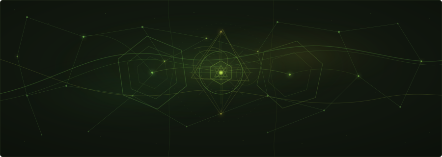
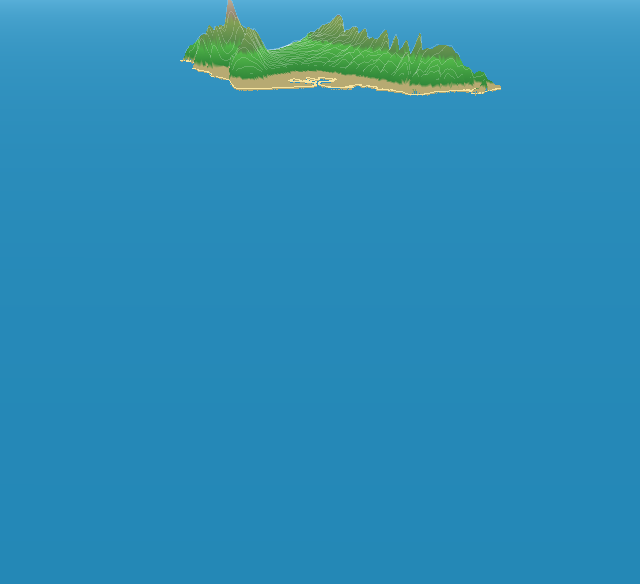

<p align="center">
  
</p>

<p align="center">
  <a href="https://github.com/nshkrdotcom/frappy">
    
  </a>
  <a href="LICENSE">
    
  </a>
</p>

# Prappy

Prappy is a native C++20 GPU visualization workbench. It uses SDL3 for the
window and input layer, bgfx for renderer abstraction, Dear ImGui for the tool
UI, and CMake/Ninja/MSVC for the Windows build.

<p align="center">
  
</p>

The app lives in:

```text
C:\Users\windo\projects\n\prappy
```

The reusable Windows setup and native C++ tooling live in:

```text
C:\Users\windo\projects\dotfiles_private\windows\bootstrap_windows\native_cpp
```

The scripts in this repo are thin wrappers around that shared tooling, so the
same commands should work on a clean Windows 11 machine after cloning the repos
into the expected layout.

## Quick Start

Open PowerShell 7 or Windows Terminal:

```powershell
cd C:\Users\windo\projects\n\prappy
pwsh scripts\bootstrap.ps1
pwsh scripts\doctor.ps1
pwsh scripts\deps.ps1
pwsh scripts\configure.ps1
pwsh scripts\build.ps1
pwsh scripts\run.ps1
```

If `bootstrap.ps1` installs or updates tools, close and reopen PowerShell before
continuing with the later commands.

## Daily Loop

```powershell
cd C:\Users\windo\projects\n\prappy
pwsh scripts\build.ps1
pwsh scripts\run.ps1
```

Smoke-test the current build:

```powershell
pwsh scripts\visual-regression.ps1
```

That script also validates the generated Oahu topology header before running
the capture checks, including a top-down Oahu diagnostic capture.

Screenshots from the capture path are written below the active build directory:

```text
build\windows-msvc-release\captures\
```

Use the Oahu isolation view when checking coastline shape, mesh fill, or camera
distortion:

```powershell
pwsh scripts\run.ps1 -Preset OahuDebugMesh -Focus -NoOverlay
```

For interactive Oahu work, run without `-NoOverlay` so the focus-mode canvas
shows the `Top Down`, `Coast`, `Centered`, `Mesh`, and `Flyover` controls:

```powershell
pwsh scripts\run.ps1 -Preset OahuCenteredTopDown -Focus
```

Named presentation presets are available from the UI and the run script:

```powershell
pwsh scripts\run.ps1 -Preset RandomLinesHero
pwsh scripts\run.ps1 -Preset StarfieldHero
pwsh scripts\run.ps1 -Preset OahuFlyover
pwsh scripts\run.ps1 -Preset OahuCenteredTopDown
pwsh scripts\run.ps1 -Preset OahuDebugMesh
pwsh scripts\run.ps1 -Preset ParticlesHero
```

## Guides

- [Setup](guides/setup.md)
- [Development Workflow](guides/development.md)
- [Visualization Guide](guides/visualizations.md)
- [Architecture](guides/architecture.md)
- [Oahu Topology Data](guides/oahu-topology.md)
- [Reproducible Windows Tooling](guides/windows-tooling.md)
- [Troubleshooting](guides/troubleshooting.md)

## Current Visualizations

- Random Lines 2D
- Infinite Starfield
- Oahu Flyover
- GPU Particle Field

The app has a reusable visualization module contract, named presentation
presets, shared camera controls for 3D modules, renderer diagnostics, renderer
override support, and a bgfx-backed screenshot export path.

The GPU Particle Field now has a bgfx compute simulation path on renderers that
support compute shaders, plus a portable CPU simulation fallback. Both paths
render through retained/updateable bgfx dynamic vertex buffers and dedicated
particle shaders, using the shared shader/buffer/pass lifecycle helpers.

The Oahu visualization is generated from committed topology data: 4,096
coastline samples, a 241 x 181 terrain grid, and two smoothing passes over
USGS elevation samples. Its filled terrain now renders through a retained bgfx
indexed mesh with dedicated terrain shaders; coastline, ridge, grid, and
landmark layers remain available as diagnostic overlays.
